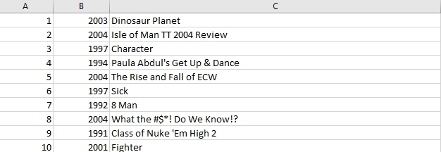
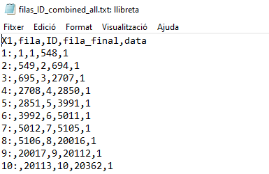
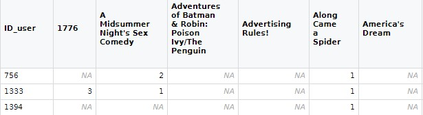

```{r setup, include=FALSE}
knitr::opts_chunk$set(echo = FALSE)
```
```{r, message=FALSE, warning=FALSE}
library(tidyverse)
```
# Presentación del proyecto

## Presentación del proyecto

Netflix nos ha contratado para realizar un modelo de machine learning que sea capaz de recomendar películas en función de los gustos de usuarios.

En esta presentación explicaremos todo el proceso que hemos realizado hasta conseguir el modelo.

Netflix nos ha proporcionado varios archivos de datos.

## Presentación del proyecto

El primero de estos es el documento llamado “movie title.csv”. En este archivo encontramos todos los títulos de todas las películas que se encuentran en esta plataforma, además de su año de estreno y un identificador propio. En total hay 17.770 films distintos.



## Presentación del proyecto

Por otro lado, tenemos 4 archivos los cuales contienen para cada película todas sus valoraciones.


## Presentación del proyecto

Por último, el archivo "filas_ID_combined_all.txt", donde vemos cada metraje donde tiene sus valoraciones.



# Ingesta de datos
## Ingesta de datos

Escogemos una muestra de 250 filas del fichero "filas_ID_combined_all" en base a la semilla generada por nuestros DNI.

```{r, echo = TRUE}
set.seed(23307791)
muestra_grupo=sample(1:17770,250, replace=FALSE)
head(muestra_grupo)
```

## Ingesta de datos

Separamos las películas en función del fichero en el que estaban. Al hacer esto obtenemos 4 tablas que tienen la siguiente información:

```{r, message = FALSE}
filas_ID_combined_all=read_csv("../filas_ID_combined_all.txt")

muestra_data1 <- filter(filas_ID_combined_all[muestra_grupo,], data==1, .preserve = TRUE)
muestra_data2 <- filter(filas_ID_combined_all[muestra_grupo,], data==2, .preserve = TRUE)
muestra_data3 <- filter(filas_ID_combined_all[muestra_grupo,], data==3, .preserve = TRUE)
muestra_data4 <- filter(filas_ID_combined_all[muestra_grupo,], data==4, .preserve = TRUE)
```

```{r, echo = TRUE}
head(muestra_data1)
```

## Ingesta de datos

Para cada una de estas tablas, miramos las filas donde estaban las valoraciones de cada película y las escribíamos en muestra películas con el siguiente formato:

```{r, message = FALSE}
fileName <- "muestrapeliculas.txt"
netflix = read_tsv(fileName, col_names = FALSE)
```

```{r, echo=TRUE}
head(netflix)
```

# Modelo de datos
## Modelo de datos
Es necesario crear una o varias tablas con un formato apropiado para poder tratar los datos correctamente.
A lo largo del análisis se crean diversas tablas, pero la principal es la tabla "netflix".

```{r, message=FALSE}
# Añadimos una columna con el nº de fila
netflix=netflix%>% mutate(fila=row_number())

# Cogemos de la tabla netflix las filas que contienen un ID de pelicula
# y las añadimos como una nueva columna
filas=grep(":",netflix$X1)
filas_ID= netflix %>%
  filter( fila %in% filas ) %>%
  mutate(ID=as.integer(gsub(":","",X1)))

# Guardamos cuantas valoraciones tiene cada pelicula
reps=diff(c(filas_ID$fila,max(netflix$fila)+1))

# Asignamos a cada valoracion la id de su pelicula correspondiente en la
# columna ID_film, eliminamos las filas que contienen unicamente un ID y 
# separamos los datos de las valoraciones en las columnas ID_user, Score y date
netflix=netflix %>%
  mutate(ID1=rep(filas_ID$X1,times=reps)) %>%
  filter(!(fila %in% filas)) %>%
  select(-fila) %>%
  separate(X1,into=c("ID_user","Score","date"),sep=",") %>%
  mutate(Score=as.integer(Score)) %>%
  separate(col = ID1,into=c("ID_film","borrar")) %>%
  select(-borrar) %>% mutate(ID_film=as.numeric(ID_film))
```
```{r}
head(netflix)
```

## Modelo de datos
Para poder identificar de que película se trata, añadiremos a la tabla anterior el respectivo título a cada fila.

```{r, message=FALSE, warning=FALSE}
lines   <- readLines("../movie_titles.csv")
pattern <- "^(\\d+),([^,]+),(.*)$"
matches <- regexec(pattern, lines)

bad.rows <- which(sapply(matches, length) == 1L)
if (length(bad.rows) > 0L) stop(paste("bad row: ", lines[bad.rows]))

data <- regmatches(lines, matches)
film_names <- as.data.frame(matrix(unlist(data), ncol = 4L, byrow = TRUE)[, -1L])
colnames(film_names) <- c("ID_film", "year", "title")
film_names$ID_film <- as.integer(film_names$ID_film)
film_names$year <- as.integer(film_names$year)
netflix_f <- inner_join(netflix, film_names, by="ID_film")
```
```{r}
head(netflix_f)
```

## Modelo de datos
Cambiamos el tipo de dato de los atributos:

```{r, message=FALSE}
netflix_f$ID_user <- as.factor(netflix_f$ID_user)
netflix_f$date <- as.Date(netflix_f$date)
netflix_f$ID_film <- as.factor(netflix_f$ID_film)
netflix_f$title <- as.factor(netflix_f$title)
```
```{r}
head(netflix_f)
```

# Análisis exploratorio de los datos

## Análisis exploratorio de los datos
Creamos una tabla donde para cada película tenemos la cantidad de valoraciones, la media, la desviación estándar, etc. 

```{r, message=FALSE}
#Definimos una funcion para calcular la moda
getmode <- function(v) {
             uniqv <- unique(v)
             uniqv[which.max(tabulate(match(v, uniqv)))]
}

estadisticos <- tally(group_by(netflix,ID_film))
colnames(estadisticos) <- c("ID_film", "count")
#La función aggregate se usa para calcular las nuevas columnas, agrupando por ID de film.
estadisticos <- mutate(estadisticos,
        sum=aggregate(netflix$Score, by=list(Category=netflix$ID_film), FUN=sum)$x,
        mean=sum/count,
        sd=aggregate(netflix$Score, by=list(Category=netflix$ID_film), FUN=sd)$x,
        median=aggregate(netflix$Score, by=list(Category=netflix$ID_film), FUN=median)$x,
        mode=aggregate(netflix$Score, by=list(Category=netflix$ID_film), FUN=getmode)$x
        )

```
```{r}
head(estadisticos)
```


## Análisis exploratorio de los datos
Netflix está interesado en películas actuales, pero también tiene un pequeño repertorio de películas clásicas.

```{r}
select(netflix_f,ID_film,year) %>% distinct %>%
ggplot + stat_count(mapping = aes(x = year), fill="#EC7063") +
  ggtitle("Número de películas estrenadas por año")
```

## Análisis exploratorio de los datos

```{r, message=FALSE}
film_names_factor <- select(film_names,ID_film,title)
film_names_factor$ID_film <- as.factor(film_names$ID_film)

masvaloradas <- estadisticos %>% arrange(desc(count)) %>% head(5)

masvaloradas$ID_film <- as.factor(masvaloradas$ID_film)
masvaloradas <- inner_join(masvaloradas, film_names_factor, "ID_film")

masval_netflix <- netflix_f %>% filter(ID_film %in% masvaloradas$ID_film)
```
```{r Fig1}
ggplot(data=masval_netflix, mapping = aes(x = title, y = Score)) +  geom_boxplot() + 
  coord_flip() + ggtitle("Distribución de las puntuaciones por película")
```

## Análisis exploratorio de los datos

```{r fig2, message=FALSE}
ggplot(data=masval_netflix, mapping = aes(x = title, y = date)) + geom_violin() + 
  coord_flip() + ggtitle("Densidad de valoraciones por fecha de publicación")
```

## Análisis exploratorio de los datos

```{r fig3}
ggplot(data=masvaloradas, mapping = aes(x = title, y=sd)) + geom_col(fill="#EC7063") + 
  ggtitle("Comparación de la desviación estándar") + 
  theme(axis.text.x=element_text(angle=45,hjust=1,vjust=1))
```


## Análisis exploratorio de los datos

```{r fig4, message=FALSE}
ggplot(data=masval_netflix, mapping = aes(x = date)) + geom_histogram(fill="#EC7063") + 
  ggtitle("Valoraciones totales por fecha de publicación")
```

## Análisis exploratorio de los datos

```{r, message=FALSE, warning=FALSE}
library(lubridate)
colnames(netflix_f)[5] <- "release_year"
netflix_f <- mutate(netflix_f, year = year(date), 
                  month = month(date, label=TRUE), 
                  week = week(date), 
                  day_of_week = wday(date, week_start = 1, label = TRUE,abbr = FALSE))
```

```{r fig6}
ggplot(data=netflix_f, mapping = aes(x = day_of_week)) + 
  geom_bar(fill="#EC7063") + 
  ggtitle("Número de valoraciones por días de la semana")
```


```{r}
#Obtenemos para cada pelicula y cada año, cuantas valoraciones se han hecho
valoracionXaño <- netflix_f %>% group_by(ID_film,year) %>% tally

#Añadimos a la tabla el título de cada película
valoracionXaño <- valoracionXaño %>% inner_join(film_names_factor,by="ID_film")
#Dejamos solo los datos de las 10 películas con más valoraciones
diezmasvaloradas <- estadisticos %>% arrange(desc(count)) %>% head(10)
```

## Análisis exploratorio de los datos

```{r fig8}
#Calculamos la media de las valoraciones para cada película y cada año
aux2 <- aggregate(netflix_f$Score, by=list(title=netflix_f$title,ID_film=netflix_f$ID_film,
                                         year=netflix_f$year), FUN=mean)
#Nos quedamos solo con las 10 películas más valoradas
aux2 <- aux2 %>% 
  filter(ID_film %in% diezmasvaloradas$ID_film) %>% 
  arrange(desc(x))
aux2$year <- as.factor(aux2$year)

ggplot(data=aux2, mapping = aes(x = title, y=x, fill=year)) + 
  geom_bar(stat="identity", position=position_dodge2(preserve = "single")) +
  theme(axis.text.x=element_text(angle=45,hjust=1,vjust=1)) + 
  scale_fill_manual(values=c("#2C3E50","#AF7AC5","#DC7633",
                             "#48C9B0","#F4D03F","#5DADE2","#EC7063")) +
  ggtitle("Valoración media por película y año")
```

## Análisis exploratorio de los datos

```{r fig10}
usuarios <- tally(group_by(netflix_f,ID_user))
usuarios <- arrange(usuarios,desc(n))
usuarios <- head(usuarios,5)

usuariosFechas <- tally(group_by(netflix_f,ID_user,date))
usuariosFechas <- arrange(usuariosFechas,desc(n))

usuariosFechas <-subset(usuariosFechas, usuariosFechas$ID_user %in% usuarios$ID_user )

ggplot(data=usuariosFechas, aes(x=date, y=n, group=ID_user)) +
  geom_line(aes(color=ID_user)) +
  geom_point(aes(color=ID_user)) + 
  ggtitle("Valoraciones de los usuarios por fecha")
```

# Clustering

## Sistema de recomendación

Objetivo: agrupar usuarios en clusters en base a sus valoraciones.

A un usuario se le recomendarán películas a las que un usuario de su mismo cluster ha dado una buena valoración.

## Distancia entre usuarios

Cada entrada del cluster representa un usuario. De esta manera se podrá calcular la distancia entre los usuarios.



Reducimos la muestra de 310.843 a 10.000 usuarios.

## Clustering - resultado
```{r}
#Obtener tabla con el formato correcto (Id_user, puntuacion_peli1, puntuacion_peli2, ...)
model.df <- netflix_f %>% select(c(ID_user, title, Score)) %>% spread( title, Score)
```

```{r}
#Generar matriz de distancias entre usuarios
#No hace falta normalizar los datos porque todos los atributos son notas de películas)
muestra = sample(1:310843,10000, replace=FALSE)
model.reduced <- model.df[muestra,]
model.reduced <- select(model.reduced, -ID_user)
model.reduced[is.na(model.reduced)]=0
dis <- dist(model.reduced , method="euclidean")
```

```{r, fig.show='hold'}
hc <- hclust(dis, method = "complete")
plot(hc, labels=FALSE, hang=-1)
rect.hclust(hc, k=10)
groups <- cutree(hc, k=10)
```

## Limitaciones de nuestro modelo

- Fechas no representativas

- Falta de valoraciones por usuario

- Problemas computacionales (muestra reducida)

## Conclusiones

Los resultados no son los esperados.

Necesitamos más información para poder aplicar técnicas de clustering más eficaces.

Prometemos mejores resultados.

# Gracias <br>por su atención
